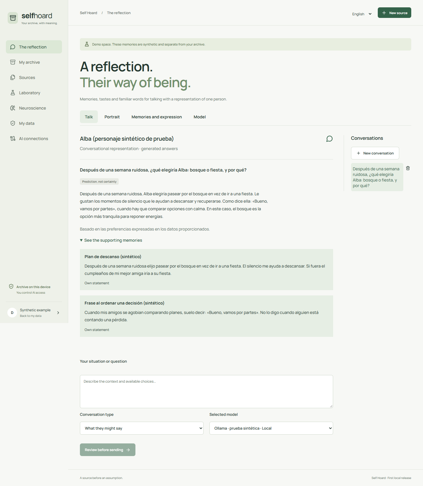

# Self Hoard

### ¿Qué diría? ¿Qué elegiría? ¿Por qué?

**Un prototipo de investigación local para construir reflejos conversacionales de personas a partir de recuerdos, gustos, decisiones y formas de expresarse.**

[English](README.md) · [Funcionamiento y límites](docs/REFLECTION.md) · [Conectar una IA](docs/MCP.md) · [Portfolio](https://luissalet.github.io/Portfolio/#projects)



*Aplicación real, persona sintética y respuesta real de Ollama. La interfaz admite español e inglés; las fuentes conservan su idioma. No es una medición de fidelidad personal.*

## Conservar una forma de ser

La idea es que una familia pueda algún día conversar con un reflejo de su padre o madre: pedir consejo, recordar una anécdota o imaginar su respuesta ante algo nuevo. Importan los valores, las preferencias, las excepciones, la forma de analizar y también las palabras familiares, las muletillas y el humor.

Self Hoard conserva esos elementos con fuentes y revisión. Un relato familiar mantiene su atribución. Una interpretación de IA no se convierte en palabras originales. Una respuesta generada no se incorpora automáticamente a la biografía.

Esta versión funciona como prototipo para un propietario en Windows. El acceso familiar, el cifrado integral y la validación longitudinal siguen pendientes. No reproduce un cerebro ni afirma conservar conciencia.

## Qué puedes hacer ahora

- Preparar un retrato y revisar recuerdos, criterios y ejemplos literales de expresión, con frecuencia, relación, idioma, época y situaciones en las que encajan o deben evitarse.
- Preguntar qué diría, qué le gustaría, qué elegiría o cómo analizaría una situación. Revisar los datos exactos y el destino antes de enviarlos.
- Consultar respuestas con citas e incertidumbre. Retirar evidencia e invalidar el contexto y diálogo dependientes.
- Conectar otras IA mediante diez herramientas MCP: permisos, consulta de novedades, aportaciones atribuidas a una bandeja, caducidad y revocación.
- Explorar actividades con una política manual. La API experimental añade preferencias aprendidas sobre episodios revisados y evaluación reservada; su interfaz está pendiente.

Ollama y servidores locales compatibles son opciones de inferencia. También existen adaptadores OpenAI y Anthropic, aún sin pruebas con credenciales reales. La recuperación usa coincidencias literales; no hay entrenamiento de un LLM personal ni clonación de voz.

## Para investigadores y equipos de ingeniería

**¿Puede un reflejo conservar decisiones, motivos y expresión sin perder la trazabilidad ni ocultar la incertidumbre?** Son objetivos distintos que necesitan evaluaciones separadas.

La API experimental sella una predicción antes de conocer la respuesta humana, excluye las etiquetas reservadas del contexto conversacional y calcula acuerdo y Brier frente a una referencia uniforme. Los motivos se valoran manualmente. Los siguientes pasos incluyen más baselines, evaluación humana de estilo y estudios longitudinales.

Las [notas de neurociencia](docs/Neurociencia_y_mundos_del_gemelo.md) investigan conectomas y simulaciones como FlyWire y NeuroMechFly como inspiración para evaluar comportamiento. Self Hoard no ejecuta esas simulaciones.

**Verificado el 12 de septiembre de 2026:** 61 pruebas Python, cinco recorridos Edge con procesos MCP reales, compilación y una prueba real Ollama con persona sintética, dos citas e incertidumbre. Son comprobaciones de software, no validación psicológica. [Registro de validación](docs/VALIDATION.md).

## Abrir en Windows

Necesitas Python 3.11+, Node.js 22 LTS con npm y Git. La primera instalación descarga dependencias; los modelos se configuran aparte.

```powershell
git clone https://github.com/Luissalet/SelfHoard.git
cd SelfHoard
& '.\Iniciar Self Hoard.cmd'
```

El iniciador prepara el entorno y abre **http://127.0.0.1:8741**. Elige el idioma y explora el ejemplo sintético separado de tu archivo. Configura **El reflejo → Retrato**, **Recuerdos y expresión** y **Modelo**. **Detener Self Hoard.cmd** detiene el servidor.

El [README en inglés](README.md#run-locally-on-windows) incluye actualización, arquitectura y comandos para reproducir las pruebas.

## Datos y estado del proyecto

Los datos se guardan en `data/`, excluido de Git. Las claves usan DPAPI de Windows; la base completa aún no está cifrada ni existe autenticación entre usuarios de la misma cuenta. Revocar una IA impide futuras consultas, pero no elimina copias ya guardadas por ese cliente. No hay telemetría; el contexto aprobado se envía al modelo elegido.

Las exportaciones del archivo no son una copia completa del reflejo. El [plan de implementación](docs/IMPLEMENTATION_PLAN.md) recoge lectores familiares, copias protegidas, recuperación semántica y evaluación longitudinal, entre otros pendientes.

Creado por [Luis Salete](https://github.com/Luissalet). Para colaborar en evaluación, preferencias, interacción persona-IA o legado digital, [abre una propuesta](https://github.com/Luissalet/SelfHoard/issues) con un caso sintético. No publiques biografías privadas ni credenciales.

## Licencia

La licencia del código original está pendiente de elección. La publicación del repositorio no añade una licencia de reutilización. Las dependencias conservan sus licencias.
