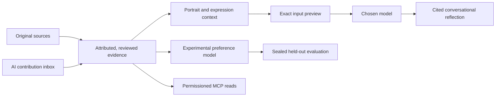

# Self Hoard

### What would they say? What would they choose? Why?

**A local-first research prototype for conversational reflections of people — built from their memories, preferences, decisions and ways of speaking.**

[Español](README.es.md) · [Research](#a-research-question-you-can-test) · [Run locally](#run-locally-on-windows) · [Connect an AI](docs/MCP.md) · [Portfolio](https://luissalet.github.io/Portfolio/#projects)


*Actual application, fictional persona and a real local Ollama response. The English interface preserves the original Spanish memories and conversation. This demonstrates an integration, not personality accuracy.*

## A person is more than a list of facts

The ambition is personal continuity: a family might one day ask a reflection of a parent for an anecdote, advice, or an opinion about a new situation. That requires preserving what mattered to them, how they weighed alternatives, exceptions to their preferences, and the phrases they used with different people.

Self Hoard makes those ingredients inspectable. A memory keeps its source. An interpretation stays an interpretation. A catchphrase keeps its context and frequency. A generated answer remains a generated answer.

The current release is a working, single-owner Windows prototype. Family reader access, longitudinal validation and complete archive encryption are still ahead. It does not claim to reproduce consciousness or a human brain.

## Follow one reflection from evidence to answer

1. **Preserve the words.** Add sources and memory cards with literal excerpts and attribution. Owner statements, family recollections and AI interpretations remain distinguishable.
2. **Review the person being represented.** Confirm memories, criteria and expression examples. Catchphrases, humor, rhythm and described gestures can specify relationship, language, period, frequency, when to use them and when to avoid them.
3. **Ask a situated question.** “Would they enjoy this?”, “Which option would they choose?”, “How would they analyze it?” or “Tell me an anecdote.”
4. **Inspect the exact model input.** Preview evidence, instructions, destination and configured limits before sending. Local inference is the default.
5. **Read an attributed simulation.** Responses retain citations; predictions and analyses must express uncertainty. Withdrawing evidence invalidates dependent context and dialogue.

The synthetic persona above prefers a forest walk after a noisy week, but makes an exception for a close friend's birthday. “Bueno, vamos por partes” is a contextual expression example, not an instruction to insert a catchphrase into every answer.

## What is implemented

| Area | Available now | Boundary |
| --- | --- | --- |
| Personal archive | SQLite sources, literal quotes, review, attribution, dependency invalidation, JSON/Markdown export | Literal lexical retrieval; archive export is not a complete reflection backup |
| Reflection | Portrait, memory and expression cards, exact input preview, cited conversation, ES/EN interface | No personal LLM fine-tuning, audio style extraction or voice cloning |
| Model connections | Ollama, local OpenAI-compatible servers, OpenAI Responses and Anthropic Messages adapters | Real Ollama checked; cloud adapters have no live credential-based verification yet |
| AI interoperability | Ten MCP tools, scoped reads, change polling, attributed update inbox, expiry and revocation | AI clients cannot approve evidence or grant themselves access |
| Decision research API | Reviewed episodes, regularized pairwise preference fitting, abstention near ties, sealed trials | Human-supplied feature ratings; uncalibrated estimates; evaluation UI pending |
| Visual laboratory | Activity scenarios, manual priorities, hidden predictions and revealed comparisons | Manual-policy demonstration, not a learned digital twin or neural simulation |

## A research question you can test

**Can a reflection preserve a person's choices, explanations and expression while making its evidence and uncertainty inspectable?**

These are separate targets. Sounding familiar is not evidence of choosing accurately; choosing correctly does not establish that a stated reason matches the person's reason.

The experimental decision API stores held-out answers separately. It seals a prediction and model version before receiving the human answer, then reports choice agreement and Brier score against a uniform reference. A person can rate the match between reasons. Held-out labels are excluded from conversational retrieval. These mechanisms support experiments; they are not results from a participant study.

Useful next investigations:

- **Preference generalization:** held-out situations, changing constraints, explicit exceptions and additional simple baselines.
- **Expression fidelity:** context-appropriate phrasing, overused mannerisms and relationship-specific language.
- **Evidence reliability:** unsupported statements, attribution mistakes, withdrawal and justified abstention.
- **Change over time:** evolving preferences without silently replacing earlier versions of a person.

The [neuroscience notes](docs/Neurociencia_y_mundos_del_gemelo.md) examine connectomes and embodied simulation, including FlyWire and NeuroMechFly, as inspiration for testing behavior in controlled environments. Self Hoard does not execute those simulators or equate a language-model reflection with a connectome.

## Engineering worth inspecting



- **Evidence lifecycle:** `store.py` and `reflection.py` track review, provenance and dependencies. Source withdrawal is exercised across storage, UI and MCP.
- **Model boundary:** `providers.py` binds each send to its approved provider snapshot. Local destinations are loopback-only, remote endpoints are fixed; there are no automatic retries, tool calls or fallback providers.
- **Agent boundary:** `agents.py` and `mcp_server.py` expose owner-granted scopes. `reflection.read` is independent of ordinary context access. Accepted AI reports retain attribution.
- **Evaluation boundary:** `decisions.py` separates fitting data from held-out answers. Feature contributions explain the formula, not private human thought.
- **Product layer:** React 19, TypeScript and locally served fonts over FastAPI and SQLite, with bilingual UI and separate synthetic demo storage.

[Architecture](docs/ARCHITECTURE.md) · [Reflection contracts](docs/REFLECTION.md) · [Implementation plan](docs/IMPLEMENTATION_PLAN.md)

## Verification, with its limits

Recorded on **12 September 2026**:

- **61 Python tests passed**, covering provenance, permissions, invalidation, provider boundaries and experimental evaluation.
- **5 Microsoft Edge end-to-end flows passed**, including real MCP client/server processes, review, withdrawal and revoked access. The conversation browser test uses a synthetic HTTP model fixture.
- **One real Ollama check** with `qwen3-coder:30b` returned a synthetic-person prediction with two valid citation IDs and uncertainty.
- TypeScript/Vite production build and Python dependency checks passed.

These verify software and integrations. They do not establish psychological validity, identity fidelity, accuracy on real people, or semantic support for every generated sentence. See the [validation record](docs/VALIDATION.md) for scope and known warnings.

## Run locally on Windows

Prerequisites: **Python 3.11+**, **Node.js 22 LTS with npm**, and Git. First installation downloads dependencies. Conversations also need a model connection; model weights are not bundled.

```powershell
git clone https://github.com/Luissalet/SelfHoard.git
cd SelfHoard
& '.\Iniciar Self Hoard.cmd'
```

The launcher prepares Python, builds the interface when missing and opens **http://127.0.0.1:8741**. Choose English or Español in the header. **Synthetic example / Ejemplo sintético** uses separate demo data. Prepare a portrait and reviewed memories, then configure **The reflection → Model**.

**Detener Self Hoard.cmd** stops the server. After pulling an update, refresh dependencies and rebuild before restarting:

```powershell
.\.venv\Scripts\python.exe -m pip install -r requirements-lock.txt
Push-Location frontend
npm.cmd ci
npm.cmd run build
Pop-Location
```

### Reproduce the checks

```powershell
.\.venv\Scripts\python.exe -m pytest -q
.\.venv\Scripts\python.exe -m pip check
```

For browser tests, start a separate test server in one terminal:

```powershell
.\.venv\Scripts\python.exe -m selfhoard --port 8742 --data-dir .impeccable/review/test-data
```

In another terminal, with Microsoft Edge installed:

```powershell
cd frontend
npm.cmd run test:e2e
```

Opt-in real-model check, using synthetic data on port 8742 and an already installed Ollama model:

```powershell
.\.venv\Scripts\python.exe scripts/smoke_reflection_local.py --model qwen3-coder:30b --output .impeccable/review/local-reflection-result.json
```

## Connect another AI

An MCP client can read permitted context, check for changes, contribute attributed knowledge to an inbox or run a permitted activity trial. The owner controls scopes, review, pause, expiry and revocation in **AI connections**. Reading the reflection requires its own permission.

The application provides client configuration. Keep its credential private. See [MCP setup, tools and trust boundaries](docs/MCP.md). Change detection currently uses polling, not push notifications.

## Data and trust boundaries

Personal data lives under the ignored `data/` directory, separate from the demo. There is no telemetry. Model requests send approved context to the selected destination; external MCP clients have their own providers and retention behavior.

Windows DPAPI protects cloud-provider keys. **The full archive is not encrypted, and the application does not authenticate different users of the same Windows account.** Local origin checks are not an OS sandbox. Revocation blocks future reads; it cannot erase copies another client already retained. This prototype is intended for local use, not public multi-user hosting.

No personal archive, private planning documents or credentials are included. Published screenshots use synthetic data only.

## Research and collaboration

Built by [Luis Salete](https://github.com/Luissalet). I am interested in collaborations around human-centered AI, models of preference, evaluation, personal knowledge systems and digital legacy.

For researchers: propose a protocol, baseline or failure case. For engineers and recruiters: follow the evidence-to-answer flow and reproducible tests. [Open an issue](https://github.com/Luissalet/SelfHoard/issues) with a concrete question or synthetic example; please do not post private biographies or credentials.

The [implementation plan](docs/IMPLEMENTATION_PLAN.md) tracks family readers, complete protected backups, semantic retrieval, longitudinal evaluation and the remaining work.

## License

A license for the original project code has not been selected yet. Public availability is not an additional license grant. Dependencies retain their respective licenses.
